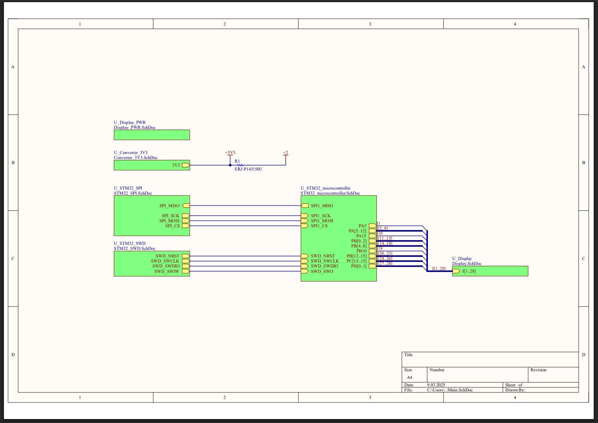

# VFD Display Driver – HLD336WA

This project provides both hardware (PCB) and firmware (FreeRTOS-based) for driving a **cheap HLD336WA VFD display** (around $3 from China).  
The PCB was manufactured by **JLCPCB**, and the driver allows the display to be controlled through **SPI**.

---

## Features

- Support for the **HLD336WA VFD display**
- **FreeRTOS firmware** for efficient task handling
- **SPI interface** for control
- Example script for **Raspberry Pi** included ([`/RPI_SCRIPT`](./RPI_SCRIPT))
- Refresh rate: **60 Hz**
- Full control over **each segment and column**

---

## Hardware Notes

⚠️ **Important schematic note:**  
The provided schematic is **not 100% correct**.  
- Pins **COM** of the `ULN2003ADR` were incorrectly tied to **GND**.  
- To make the board work, the COM pins had to be **lifted during soldering** (left floating).  

Please keep this in mind if you want to replicate the hardware.

---

## Repository Structure

- `/FW` – FreeRTOS firmware for the controller  
- `/HW` – Hardware design files  
- `/RPI_SCRIPT` – Example Python script for Raspberry Pi to display data  
- `/IMGs` – Images, PCB renders, and schematic  

---

## Raspberry Pi Example

The controller can be driven directly via **SPI**.  
An example script is provided in [`/RPI_SCRIPT`](./RPI_SCRIPT), showing how to send data to the display.

---

## Schematic

📄 [Main schematic PDF](./IMGs/VFD_controller_stm_SCHEMATIC.pdf)

---

## Hardware Interfaces & Power

The board includes connectors for **SPI**, **SWD**, and a **DC power jack** (male, angled 90°, THT, 5.5/2.5 mm). Power is supplied from a standard **19 V laptop adapter**, which is then stepped down by an onboard converter to **3.3 V for the CPU**. The **SPI interface is galvanically isolated** using an **ADUM1401**, and the board is protected against short circuits with a **1 A PTC fuse** and **SS34 diode**.

All connectors are ESD protected.

---

## Screenshots & Diagrams

 
  
 
 
 
 
 

---

## License

MIT License – see [LICENSE](./LICENSE) for details.
